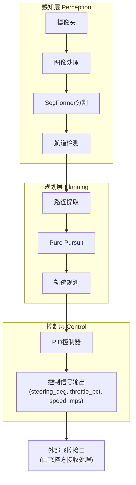

# River Lane Pilot - 自主驾驶水上无人船导航系统

> **河道视觉导航解决方案** | 基于深度学习的实时路径规划和控制信号生成


## 📋 项目概述

River Lane Pilot 是一个基于 SegFormer 深度学习模型的自主驾驶水上无人船(USV)导航系统。该系统专为河道环境设计，通过计算机视觉技术识别航道边界线，并使用 Pure Pursuit 算法和 PID 控制器实现自主路径跟踪和控制信号输出。

**核心职责**：感知 → 规划 → 控制信号生成（由外部飞控对接处理实际执行）

### 🎯 主要特性

- **🧠 智能感知**：基于SegFormer的深度学习语义分割
- **🛣️ 航道检测**：精确的河道边界线识别与跟踪  
- **🎮 路径规划**：Pure Pursuit算法实现平滑路径跟踪
- **⚡ 控制信号**：PID控制器输出 steering_deg / throttle_pct / speed_mps
- **🔍 实时处理**：支持相机实时处理和离线批量处理
- **🧪 完整验证**：内置可视化调试工具和里程记录
- **📊 数据导出**：输出CSV格式的轨迹和控制数据

## 🏗️ 系统架构



## 💻 硬件需求

### 推荐硬件配置

| 组件 | 规格 | 说明 |
|------|------|------|
| **计算平台** | NVIDIA Jetson Orin Nano 8GB | 支持CUDA/TensorRT加速 |
| **操作系统** | JetPack 6.2 (Ubuntu 22.04) | Python 3.8+ 兼容 |
| **摄像头** | GMSL IMX390 或 USB摄像头 | 1280x720@30fps |
| **存储** | 32GB SSD | 用于模型和数据 |
| **电源** | 12V/24V直流电源 | 根据平台要求 |

### 最小化配置
- **CPU**: Intel i5 或 ARM64 (4核+)
- **内存**: 8GB RAM
- **存储**: 32GB可用空间
- **摄像头**: USB 或 MIPI CSI 接口

## 📦 安装指南

### 1. 系统准备

#### Ubuntu 22.04 (推荐)
```bash
# 更新系统
sudo apt update && sudo apt upgrade -y

# 安装Python开发工具
sudo apt install -y python3-pip python3-venv python3-dev
```

#### NVIDIA Jetson设备
```bash
# 安装JetPack 6.2 (包含CUDA/TensorRT)
# 参考: https://developer.nvidia.com/jetpack

# 安装Jetson专用包
sudo apt install python3-jetson-gpio jetson-stats -y
```

### 2. 环境设置

```bash
# 创建虚拟环境（可选但推荐）
python3 -m venv venv
source venv/bin/activate

# 安装依赖
pip install -r requirements.txt

# 检查安装
python3 -c "import torch; print(f'PyTorch {torch.__version__}')"
python3 -c "import cv2; print(f'OpenCV {cv2.__version__}')"
```

### 3. 模型准备

```bash
# 确保模型文件存在
ls -la models/segformer_river/

# 模型应包含：
# - best_model.pth (训练好的权重)
# - 可选：model.onnx (ONNX格式，用于部署)
```

## 🚀 快速开始

### 1. 图片批处理模式

```bash
# 使用预先标注的mask进行测试
python scripts/realtime_pilot.py \
    --images dataset_final/images/val \
    --masks dataset_final/masks/val \
    --output results/

# 使用训练好的模型进行推理
python scripts/realtime_pilot.py \
    --images dataset_final/images/val \
    --model models/segformer_river/best_model.pth \
    --output results/ \
    --show
```

### 2. 实时相机处理

```bash
# 实时处理摄像头输入
python scripts/realtime_pilot.py \
    --camera 0 \
    --model models/segformer_river/best_model.pth \
    --show

# 启用相机投影模型（精确坐标）
python scripts/realtime_pilot.py \
    --camera 0 \
    --model models/segformer_river/best_model.pth \
    --camera-height 0.5 \
    --camera-pitch 10.0 \
    --camera-hfov 120.0 \
    --output results/
```

### 3. 参数调整

```bash
# 调整Pure Pursuit预瞄距离
python scripts/realtime_pilot.py \
    --images dataset_final/images/val \
    --model models/segformer_river/best_model.pth \
    --lookahead 0.25 \
    --target-speed 2.0 \
    --max-speed 3.5

# 调整河道宽度（用于坐标换算）
python scripts/realtime_pilot.py \
    --camera 0 \
    --model models/segformer_river/best_model.pth \
    --river-width 3.0 \
    --boat-speed 0.5
```

## 📊 输出说明

### 实时输出

每帧处理输出以下控制信号：

```
[dual] hdg=+2.5° steer=-1.2° throttle=65% 
X=0.42m Y=+0.08m mile=0.42m 30.5fps ok
```

含义：
- `hdg`: 航向角 (度，+右偏/-左偏)
- `steer`: 舵角 (度，+右舵/-左舵)
- `throttle`: 油门百分比 (0-100)
- `X`: 前向目标距离 (米)
- `Y`: 横向目标偏移 (米，+右/-左)
- `mile`: 总路径里程 (米)
- `fps`: 处理帧率
- `status`: 处理状态

### CSV轨迹文件

每张图像可生成对应的 CSV 文件记录完整轨迹：

```csv
idx,x_px,y_px,x_m,y_m,heading_deg,time_s
0,320,400,0.000,0.000,0.00,0.00
1,321,390,0.025,-0.003,1.25,0.06
2,323,380,0.050,-0.008,2.15,0.13
...
```

## 🔧 配置说明

主配置文件位于 `config/settings.yaml`：

```yaml
# 摄像头配置
camera:
  device_id: 0
  width: 1920
  height: 1080
  fps: 30

# SegFormer模型配置
segmentation:
  model_path: "models/segformer_river.onnx"
  input_width: 1024
  input_height: 512
  num_classes: 3  # 背景、水面、警戒线
  confidence_threshold: 0.5
  use_tensorrt: true

# Pure Pursuit参数
pure_pursuit:
  lookahead_distance: 2.0
  wheelbase: 1.5
  max_lookahead: 5.0

# PID控制参数
pid_controller:
  steering:
    kp: 1.2
    ki: 0.1
    kd: 0.05
  speed:
    kp: 0.8
    ki: 0.05
    kd: 0.02

# 船体参数
vehicle:
  max_speed: 3.0
  target_speed: 1.5
  max_steering_angle: 30.0
```

## 🔍 故障排除

### 问题 1：摄像头无法打开

```bash
# 检查设备
ls /dev/video*
v4l2-ctl --list-devices

# 权限问题
sudo usermod -a -G video $USER
sudo chmod 666 /dev/video0
```

### 问题 2：模型加载失败

```bash
# 检查模型文件
ls -la models/segformer_river/

# 验证ONNX Runtime
python3 -c "import onnxruntime; print(onnxruntime.__version__)"

# Jetson上验证TensorRT
python3 -c "import tensorrt; print(tensorrt.__version__)"
```

### 问题 3：性能不足

```bash
# 设置Jetson最大性能模式
sudo nvpmodel -m 0
sudo jetson_clocks

# 监控性能
jtop

# 减小输入分辨率或降低帧率
python scripts/realtime_pilot.py \
    --camera 0 \
    --model models/segformer_river/best_model.pth \
    --input-size 512  # 从640降至512
```

### 问题 4：控制信号异常

检查输出是否包含：
- `steering_deg`: -30 ~ +30 度 ✓
- `throttle_pct`: 0 ~ 100% ✓  
- `speed_mps`: 0 ~ max_speed ✓

超出范围则需调整配置参数或排查路径规划结果。

## 📚 开发调试

### 代码结构

```
boat/
├── config/
│   └── settings.yaml           # 核心配置
├── river_lane_pilot/
│   ├── perception/             # 感知模块（SegFormer、航道检测）
│   ├── planning/               # 规划模块（Pure Pursuit、路径处理）
│   ├── control/                # 控制模块（PID控制）
│   └── utils/                  # 工具（配置、日志、可视化）
├── scripts/
│   ├── realtime_pilot.py       # 主处理脚本
│   ├── visualize_centerline.py # 可视化工具
│   ├── plan_path.py            # 路径规划测试
│   └── ...                     # 其他工具脚本
├── training/
│   ├── train_segformer.py      # 模型训练
│   └── evaluate.py             # 模型评估
├── config/settings.yaml        # 配置文件
├── requirements.txt            # 依赖列表
└── README.md                   # 本文件
```

### 运行单元测试

```bash
# 测试感知模块
python -m pytest tests/test_perception.py -v

# 测试规划模块
python -m pytest tests/test_planning.py -v

# 测试控制模块
python -m pytest tests/test_control.py -v
```

### 代码质量检查

```bash
# 代码格式化
black river_lane_pilot/

# 代码检查
flake8 river_lane_pilot/

# 类型检查
mypy river_lane_pilot/
```

### 性能分析

```bash
# CPU占用分析
python -m cProfile -s cumtime scripts/realtime_pilot.py \
    --images dataset_final/images/val \
    --model models/segformer_river/best_model.pth \
    --num-frames 10

# 内存分析
python -m memory_profiler scripts/realtime_pilot.py \
    --camera 0 \
    --model models/segformer_river/best_model.pth
```

## 🔗 输出接口

系统生成的控制信号可通过以下方式使用：

### Python 字典格式

```python
result = {
    'steering_deg': -2.5,        # 舵角 (-30 ~ +30)
    'throttle_pct': 65.0,        # 油门百分比 (0 ~ 100)
    'speed_mps': 1.3,            # 目标速度 m/s
    'heading_deg': 2.1,          # 航向角
    'target_x_m': 0.42,          # 前向目标距离
    'target_y_m': 0.08,          # 横向目标偏移
    'total_mileage_m': 10.5,     # 总里程
    'mode': 'dual',              # 检测模式
    'pp_status': 'ok',           # Pure Pursuit状态
}
```

### CSV 数据导出

```bash
# 自动生成的CSV包含
- x_px, y_px: 像素坐标
- x_m, y_m: 世界坐标
- heading_deg: 航向角
- time_s: 预计到达时间
```

## 📄 许可证

本项目采用 [MIT License](LICENSE) 开源协议。

## 🙏 致谢

- [SegFormer](https://github.com/NVlabs/SegFormer) - 语义分割模型
- [NVIDIA Jetson](https://developer.nvidia.com/jetson) - 边缘计算平台
- [OpenCV](https://opencv.org/) - 计算机视觉库
- [PyTorch](https://pytorch.org/) - 深度学习框架

## 📞 联系与反馈

- **项目主页**: https://github.com/river-pilot/river_lane_pilot
- **问题反馈**: https://github.com/river-pilot/river_lane_pilot/issues
- **邮箱**: developer@river-pilot.com

---

**River Lane Pilot - 让水上无人船智能航行于江河之间** 🚢⚡🧠
