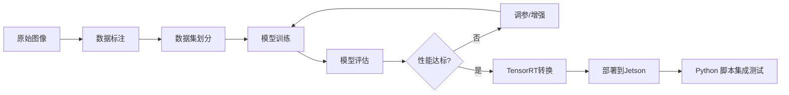

# SegFormer 模型训练完整指南

## 📋 目录
1. [工作流程总览](#工作流程总览)
2. [数据标注](#数据标注)
3. [数据集准备](#数据集准备)
4. [模型训练](#模型训练)
5. [模型评估](#模型评估)
6. [模型部署](#模型部署)


#### 任务2.2：启动训练
- [ ] 配置训练参数（见 `training/train_segformer.py`）
- [ ] 启动第一次训练
  ```bash
  python training/train_segformer.py
  ```
- [ ] 监控训练过程（TensorBoard或WandB）
- [ ] 分析训练曲线
---

## 🔄 工作流程总览



**预估时间**：
- 数据标注：2-5天（200+张图像）
- 模型训练：6-12小时（取决于GPU）
- 优化部署：1-2天
- **总计：4-8天**

---

## 🎨 数据标注

### 1.1 标注工具选择

#### 推荐方案：Labelme
```bash
# 安装Labelme
pip install labelme

# 启动标注工具
labelme dataset/images --output dataset/annotations
```

**优点**：
- 简单易用，无需服务器
- 支持多边形标注
- 直接输出JSON格式

#### 备选方案：CVAT
```bash
# Docker安装CVAT
git clone https://github.com/opencv/cvat
cd cvat
docker-compose up -d

# 访问 http://localhost:8080
```

**优点**：
- 团队协作
- 支持多人标注
- 自动标注辅助

### 1.2 标注类别定义

针对河道导航任务，定义以下**3个类别**：

| 类别ID | 类别名称 | 颜色 | 说明 |
|--------|----------|------|------|
| 0 | background | 黑色 | 背景（天空、树木、建筑等） |
| 1 | water | 蓝色 | 可通行水域 |
| 2 | boundary | 红色 | 河道边界（岸线、护栏、船只等） |

### 1.3 标注规范

#### 标注要点
1. **精确度**：边界线标注要精确到像素级
2. **一致性**：同一类别在所有图像中保持一致
3. **完整性**：标注整个图像，不留空白区域
4. **特殊情况**：
   - 倒影：标注为水域
   - 阴影：按实际类别标注
   - 模糊区域：按最可能类别标注

#### Labelme标注步骤
```bash
# 1. 启动Labelme
labelme

# 2. 打开图像文件夹
File -> Open Dir -> 选择 dataset/ 文件夹

# 3. 创建标签文件
右键 -> Edit Label List -> 添加
- background
- water  
- boundary

# 4. 开始标注
- 选择 "Create Polygons" 工具
- 沿着边界点击绘制多边形
- 双击完成当前区域
- 选择对应的标签

# 5. 保存
Ctrl+S 保存当前图像标注
下一张：D键
上一张：A键
```

### 1.4 标注质量检查

```python
# scripts/check_annotations.py
import os
import json
from pathlib import Path

def check_annotation_quality(annotation_dir):
    """检查标注质量"""
    issues = []
    
    for json_file in Path(annotation_dir).glob("*.json"):
        with open(json_file) as f:
            data = json.load(f)
        
        # 检查是否有标注
        if not data.get('shapes'):
            issues.append(f"{json_file.name}: 没有标注")
            continue
        
        # 检查类别是否正确
        labels = {s['label'] for s in data['shapes']}
        valid_labels = {'background', 'water', 'boundary'}
        if not labels.issubset(valid_labels):
            issues.append(f"{json_file.name}: 包含无效类别 {labels - valid_labels}")
        
        # 检查是否标注完整
        if len(data['shapes']) < 2:
            issues.append(f"{json_file.name}: 标注区域过少")
    
    return issues

if __name__ == "__main__":
    issues = check_annotation_quality("dataset/annotations")
    if issues:
        print("发现以下问题：")
        for issue in issues:
            print(f"  - {issue}")
    else:
        print("✓ 所有标注检查通过！")
```

---

## 📊 数据集准备

### 2.1 数据集目录结构

创建标准的语义分割数据集格式：

```bash
dataset/
├── images/              # 原始图像
│   ├── train/
│   │   ├── 1_frame_000000.jpg
│   │   └── ...
│   ├── val/
│   └── test/
├── masks/               # 分割掩码
│   ├── train/
│   │   ├── 1_frame_000000.png  # 单通道PNG，像素值0-2
│   │   └── ...
│   ├── val/
│   └── test/
└── splits/              # 数据集划分列表
    ├── train.txt
    ├── val.txt
    └── test.txt
```

### 2.2 标注格式转换

将Labelme JSON转换为PNG掩码：

```python
# scripts/labelme_to_mask.py
import json
import numpy as np
from PIL import Image
import labelme
from pathlib import Path
from tqdm import tqdm

def labelme_to_mask(json_path, output_path):
    """将Labelme JSON转换为分割掩码"""
    
    # 类别映射
    label_map = {
        'background': 0,
        'water': 1,
        'boundary': 2
    }
    
    # 读取JSON
    with open(json_path) as f:
        data = json.load(f)
    
    # 获取图像尺寸
    height = data['imageHeight']
    width = data['imageWidth']
    
    # 创建空白掩码
    mask = np.zeros((height, width), dtype=np.uint8)
    
    # 填充多边形
    for shape in data['shapes']:
        label = shape['label']
        points = np.array(shape['points'], dtype=np.int32)
        
        # 使用labelme工具填充多边形
        label_id = label_map.get(label, 0)
        mask = labelme.utils.shape_to_mask(
            (height, width), points, shape_type='polygon'
        )
        mask = mask.astype(np.uint8) * label_id
    
    # 保存为PNG（使用调色板模式）
    mask_img = Image.fromarray(mask, mode='P')
    mask_img.save(output_path)

def convert_all_annotations(input_dir, output_dir):
    """批量转换所有标注"""
    input_path = Path(input_dir)
    output_path = Path(output_dir)
    output_path.mkdir(parents=True, exist_ok=True)
    
    json_files = list(input_path.glob("*.json"))
    
    for json_file in tqdm(json_files, desc="转换标注"):
        output_file = output_path / f"{json_file.stem}.png"
        labelme_to_mask(json_file, output_file)
    
    print(f"✓ 转换完成！共处理 {len(json_files)} 个文件")

if __name__ == "__main__":
    convert_all_annotations(
        input_dir="dataset/annotations",
        output_dir="dataset/masks"
    )
```

### 2.3 数据集划分

```python
# scripts/split_dataset.py
import os
import random
from pathlib import Path
from shutil import copy2

def split_dataset(data_dir, output_dir, split_ratio=(0.7, 0.15, 0.15)):
    """划分数据集为训练集、验证集、测试集"""
    
    train_ratio, val_ratio, test_ratio = split_ratio
    assert abs(sum(split_ratio) - 1.0) < 1e-6, "比例之和必须为1"
    
    # 获取所有图像文件
    image_files = sorted(Path(data_dir).glob("*.jpg"))
    random.shuffle(image_files)
    
    n_total = len(image_files)
    n_train = int(n_total * train_ratio)
    n_val = int(n_total * val_ratio)
    
    # 划分
    train_files = image_files[:n_train]
    val_files = image_files[n_train:n_train+n_val]
    test_files = image_files[n_train+n_val:]
    
    print(f"数据集划分：")
    print(f"  训练集: {len(train_files)} ({train_ratio*100:.0f}%)")
    print(f"  验证集: {len(val_files)} ({val_ratio*100:.0f}%)")
    print(f"  测试集: {len(test_files)} ({test_ratio*100:.0f}%)")
    
    # 创建目录结构
    for split in ['train', 'val', 'test']:
        (Path(output_dir) / 'images' / split).mkdir(parents=True, exist_ok=True)
        (Path(output_dir) / 'masks' / split).mkdir(parents=True, exist_ok=True)
    
    # 复制文件
    def copy_files(files, split):
        for img_file in files:
            # 复制图像
            copy2(img_file, Path(output_dir) / 'images' / split / img_file.name)
            
            # 复制掩码
            mask_file = Path(data_dir).parent / 'masks' / f"{img_file.stem}.png"
            if mask_file.exists():
                copy2(mask_file, Path(output_dir) / 'masks' / split / f"{img_file.stem}.png")
    
    copy_files(train_files, 'train')
    copy_files(val_files, 'val')
    copy_files(test_files, 'test')
    
    print("✓ 数据集划分完成！")

if __name__ == "__main__":
    random.seed(42)
    split_dataset(
        data_dir="dataset_staging/images",
        output_dir="dataset_final",
        split_ratio=(0.7, 0.15, 0.15)
    )
```

### 2.4 数据增强配置

```python
# training/augmentation.py
import albumentations as A

def get_training_augmentation():
    """训练数据增强"""
    return A.Compose([
        # 几何变换
        A.HorizontalFlip(p=0.5),
        A.ShiftScaleRotate(
            shift_limit=0.1,
            scale_limit=0.1,
            rotate_limit=15,
            p=0.5
        ),
        A.Perspective(scale=(0.05, 0.1), p=0.3),
        
        # 颜色变换（模拟不同光照条件）
        A.RandomBrightnessContrast(
            brightness_limit=0.2,
            contrast_limit=0.2,
            p=0.5
        ),
        A.HueSaturationValue(
            hue_shift_limit=20,
            sat_shift_limit=30,
            val_shift_limit=20,
            p=0.5
        ),
        
        # 模糊和噪声（模拟运动模糊、水花等）
        A.OneOf([
            A.MotionBlur(blur_limit=5, p=1.0),
            A.GaussianBlur(blur_limit=5, p=1.0),
        ], p=0.3),
        
        A.GaussNoise(var_limit=(10, 50), p=0.2),
        
        # 标准化
        A.Normalize(
            mean=[0.485, 0.456, 0.406],
            std=[0.229, 0.224, 0.225]
        ),
    ])

def get_validation_augmentation():
    """验证数据增强（仅标准化）"""
    return A.Compose([
        A.Normalize(
            mean=[0.485, 0.456, 0.406],
            std=[0.229, 0.224, 0.225]
        ),
    ])
```

---

## 🎯 模型训练

### 3.1 训练环境准备

```bash
# 安装依赖
pip install torch torchvision torchaudio --index-url https://download.pytorch.org/whl/cu118
pip install transformers
pip install segmentation-models-pytorch
pip install albumentations
pip install tensorboard
pip install wandb  # 可选：实验跟踪

# 验证CUDA
python -c "import torch; print(f'CUDA available: {torch.cuda.is_available()}')"
```

### 3.2 训练脚本

创建完整的训练脚本：

```python
# training/train_segformer.py
import torch
import torch.nn as nn
from torch.utils.data import Dataset, DataLoader
from transformers import SegformerForSemanticSegmentation
from pathlib import Path
import numpy as np
from PIL import Image
from tqdm import tqdm
import wandb  # 可选

class RiverDataset(Dataset):
    """河道分割数据集"""
    def __init__(self, images_dir, masks_dir, transform=None):
        self.images_dir = Path(images_dir)
        self.masks_dir = Path(masks_dir)
        self.transform = transform
        self.image_files = sorted(list(self.images_dir.glob("*.jpg")))
    
    def __len__(self):
        return len(self.image_files)
    
    def __getitem__(self, idx):
        # 读取图像
        img_path = self.image_files[idx]
        image = np.array(Image.open(img_path).convert('RGB'))
        
        # 读取掩码
        mask_path = self.masks_dir / f"{img_path.stem}.png"
        mask = np.array(Image.open(mask_path))
        
        # 数据增强
        if self.transform:
            augmented = self.transform(image=image, mask=mask)
            image = augmented['image']
            mask = augmented['mask']
        
        # 转换为Tensor
        image = torch.from_numpy(image).permute(2, 0, 1).float()
        mask = torch.from_numpy(mask).long()
        
        return image, mask

class Trainer:
    """训练器"""
    def __init__(self, config):
        self.config = config
        self.device = torch.device('cuda' if torch.cuda.is_available() else 'cpu')
        
        # 初始化模型
        self.model = SegformerForSemanticSegmentation.from_pretrained(
            config['model_name'],
            num_labels=config['num_classes'],
            ignore_mismatched_sizes=True
        ).to(self.device)
        
        # 损失函数
        self.criterion = nn.CrossEntropyLoss(
            weight=torch.tensor(config['class_weights']).to(self.device)
        )
        
        # 优化器
        self.optimizer = torch.optim.AdamW(
            self.model.parameters(),
            lr=config['learning_rate'],
            weight_decay=config['weight_decay']
        )
        
        # 学习率调度器
        self.scheduler = torch.optim.lr_scheduler.CosineAnnealingLR(
            self.optimizer,
            T_max=config['epochs']
        )
        
        # 数据加载器
        from augmentation import get_training_augmentation, get_validation_augmentation
        
        self.train_dataset = RiverDataset(
            config['train_images'],
            config['train_masks'],
            transform=get_training_augmentation()
        )
        self.val_dataset = RiverDataset(
            config['val_images'],
            config['val_masks'],
            transform=get_validation_augmentation()
        )
        
        self.train_loader = DataLoader(
            self.train_dataset,
            batch_size=config['batch_size'],
            shuffle=True,
            num_workers=4,
            pin_memory=True
        )
        self.val_loader = DataLoader(
            self.val_dataset,
            batch_size=config['batch_size'],
            shuffle=False,
            num_workers=4,
            pin_memory=True
        )
        
        # 初始化wandb（可选）
        if config.get('use_wandb'):
            wandb.init(project="river-lane-pilot", config=config)
    
    def train_epoch(self, epoch):
        """训练一个epoch"""
        self.model.train()
        total_loss = 0
        
        pbar = tqdm(self.train_loader, desc=f"Epoch {epoch}")
        for images, masks in pbar:
            images = images.to(self.device)
            masks = masks.to(self.device)
            
            # 前向传播
            outputs = self.model(pixel_values=images)
            logits = outputs.logits
            
            # 调整logits尺寸以匹配mask
            logits = nn.functional.interpolate(
                logits,
                size=masks.shape[-2:],
                mode='bilinear',
                align_corners=False
            )
            
            # 计算损失
            loss = self.criterion(logits, masks)
            
            # 反向传播
            self.optimizer.zero_grad()
            loss.backward()
            self.optimizer.step()
            
            total_loss += loss.item()
            pbar.set_postfix({'loss': loss.item()})
        
        avg_loss = total_loss / len(self.train_loader)
        return avg_loss
    
    def validate(self):
        """验证"""
        self.model.eval()
        total_loss = 0
        correct = 0
        total = 0
        
        with torch.no_grad():
            for images, masks in tqdm(self.val_loader, desc="Validation"):
                images = images.to(self.device)
                masks = masks.to(self.device)
                
                outputs = self.model(pixel_values=images)
                logits = outputs.logits
                
                logits = nn.functional.interpolate(
                    logits,
                    size=masks.shape[-2:],
                    mode='bilinear',
                    align_corners=False
                )
                
                loss = self.criterion(logits, masks)
                total_loss += loss.item()
                
                # 计算准确率
                preds = torch.argmax(logits, dim=1)
                correct += (preds == masks).sum().item()
                total += masks.numel()
        
        avg_loss = total_loss / len(self.val_loader)
        accuracy = correct / total
        
        return avg_loss, accuracy
    
    def train(self):
        """完整训练流程"""
        best_loss = float('inf')
        
        for epoch in range(1, self.config['epochs'] + 1):
            # 训练
            train_loss = self.train_epoch(epoch)
            
            # 验证
            val_loss, val_acc = self.validate()
            
            # 更新学习率
            self.scheduler.step()
            
            # 打印信息
            print(f"Epoch {epoch}/{self.config['epochs']}")
            print(f"  Train Loss: {train_loss:.4f}")
            print(f"  Val Loss: {val_loss:.4f}")
            print(f"  Val Acc: {val_acc:.4f}")
            
            # 记录到wandb
            if self.config.get('use_wandb'):
                wandb.log({
                    'train_loss': train_loss,
                    'val_loss': val_loss,
                    'val_acc': val_acc,
                    'lr': self.optimizer.param_groups[0]['lr']
                })
            
            # 保存最佳模型
            if val_loss < best_loss:
                best_loss = val_loss
                torch.save(
                    self.model.state_dict(),
                    Path(self.config['output_dir']) / 'best_model.pth'
                )
                print("  ✓ 保存最佳模型")
            
            # 定期保存检查点
            if epoch % 10 == 0:
                torch.save({
                    'epoch': epoch,
                    'model_state_dict': self.model.state_dict(),
                    'optimizer_state_dict': self.optimizer.state_dict(),
                    'loss': val_loss,
                }, Path(self.config['output_dir']) / f'checkpoint_epoch_{epoch}.pth')

if __name__ == "__main__":
    config = {
        'model_name': 'nvidia/segformer-b3-finetuned-ade-512-512',
        'num_classes': 3,
        'class_weights': [0.5, 1.0, 2.0],  # background, water, boundary
        'learning_rate': 6e-5,
        'weight_decay': 0.01,
        'batch_size': 8,
        'epochs': 100,
        'train_images': 'dataset_final/images/train',
        'train_masks': 'dataset_final/masks/train',
        'val_images': 'dataset_final/images/val',
        'val_masks': 'dataset_final/masks/val',
        'output_dir': 'models/segformer_river',
        'use_wandb': False
    }
    
    # 创建输出目录
    Path(config['output_dir']).mkdir(parents=True, exist_ok=True)
    
    # 开始训练
    trainer = Trainer(config)
    trainer.train()
```

### 3.3 启动训练

```bash
# 单GPU训练
python training/train_segformer.py

# 多GPU训练（如果有）
CUDA_VISIBLE_DEVICES=0,1 python -m torch.distributed.launch \
    --nproc_per_node=2 \
    training/train_segformer.py
```

---

## 📈 模型评估

### 4.1 评估指标

```python
# training/evaluate.py
import torch
import numpy as np
from sklearn.metrics import confusion_matrix, classification_report
import matplotlib.pyplot as plt
import seaborn as sns

def calculate_miou(preds, masks, num_classes):
    """计算mIoU"""
    ious = []
    for cls in range(num_classes):
        pred_cls = (preds == cls)
        mask_cls = (masks == cls)
        
        intersection = (pred_cls & mask_cls).sum()
        union = (pred_cls | mask_cls).sum()
        
        if union == 0:
            iou = float('nan')
        else:
            iou = intersection / union
        
        ious.append(iou)
    
    return np.nanmean(ious), ious

def evaluate_model(model, dataloader, device, num_classes=3):
    """全面评估模型"""
    model.eval()
    
    all_preds = []
    all_masks = []
    
    with torch.no_grad():
        for images, masks in tqdm(dataloader):
            images = images.to(device)
            
            outputs = model(pixel_values=images)
            logits = outputs.logits
            
            logits = nn.functional.interpolate(
                logits,
                size=masks.shape[-2:],
                mode='bilinear',
                align_corners=False
            )
            
            preds = torch.argmax(logits, dim=1).cpu().numpy()
            masks = masks.numpy()
            
            all_preds.append(preds)
            all_masks.append(masks)
    
    all_preds = np.concatenate(all_preds).flatten()
    all_masks = np.concatenate(all_masks).flatten()
    
    # 计算mIoU
    miou, class_ious = calculate_miou(all_preds, all_masks, num_classes)
    
    # 混淆矩阵
    cm = confusion_matrix(all_masks, all_preds)
    
    # 分类报告
    report = classification_report(
        all_masks,
        all_preds,
        target_names=['background', 'water', 'boundary']
    )
    
    print("=" * 60)
    print("评估结果")
    print("=" * 60)
    print(f"mIoU: {miou:.4f}")
    print(f"类别IoU:")
    print(f"  Background: {class_ious[0]:.4f}")
    print(f"  Water: {class_ious[1]:.4f}")
    print(f"  Boundary: {class_ious[2]:.4f}")
    print("\n分类报告:")
    print(report)
    
    # 绘制混淆矩阵
    plt.figure(figsize=(8, 6))
    sns.heatmap(cm, annot=True, fmt='d', cmap='Blues')
    plt.title('Confusion Matrix')
    plt.ylabel('True Label')
    plt.xlabel('Predicted Label')
    plt.savefig('models/confusion_matrix.png')
    
    return miou, class_ious
```

---

## 🚀 模型部署

### 5.1 转换为ONNX

```python
# deployment/export_onnx.py
import torch
from transformers import SegformerForSemanticSegmentation

def export_to_onnx(model_path, output_path, input_size=(1, 3, 512, 512)):
    """导出为ONNX格式"""
    
    # 加载模型
    model = SegformerForSemanticSegmentation.from_pretrained(
        'nvidia/segformer-b3-finetuned-ade-512-512',
        num_labels=3
    )
    model.load_state_dict(torch.load(model_path))
    model.eval()
    
    # 创建示例输入
    dummy_input = torch.randn(*input_size)
    
    # 导出ONNX
    torch.onnx.export(
        model,
        (dummy_input,),
        output_path,
        export_params=True,
        opset_version=11,
        do_constant_folding=True,
        input_names=['input'],
        output_names=['output'],
        dynamic_axes={
            'input': {0: 'batch_size', 2: 'height', 3: 'width'},
            'output': {0: 'batch_size', 2: 'height', 3: 'width'}
        }
    )
    
    print(f"✓ ONNX模型已保存到: {output_path}")

if __name__ == "__main__":
    export_to_onnx(
        model_path='models/segformer_river/best_model.pth',
        output_path='models/segformer_river.onnx',
        input_size=(1, 3, 512, 512)
    )
```

### 5.2 转换为TensorRT

```bash
# 在Jetson设备上运行
python deployment/convert_tensorrt.py \
    --onnx models/segformer_river.onnx \
    --engine models/segformer_river.trt \
    --fp16  # 使用FP16加速
```

```python
# deployment/convert_tensorrt.py
import tensorrt as trt
import pycuda.driver as cuda
import pycuda.autoinit

def build_engine(onnx_path, engine_path, fp16=True):
    """构建TensorRT引擎"""
    
    TRT_LOGGER = trt.Logger(trt.Logger.WARNING)
    builder = trt.Builder(TRT_LOGGER)
    network = builder.create_network(
        1 << int(trt.NetworkDefinitionCreationFlag.EXPLICIT_BATCH)
    )
    parser = trt.OnnxParser(network, TRT_LOGGER)
    
    # 解析ONNX
    with open(onnx_path, 'rb') as model:
        if not parser.parse(model.read()):
            for error in range(parser.num_errors):
                print(parser.get_error(error))
            return None
    
    # 配置
    config = builder.create_builder_config()
    config.max_workspace_size = 1 << 30  # 1GB
    
    if fp16 and builder.platform_has_fast_fp16:
        config.set_flag(trt.BuilderFlag.FP16)
        print("启用FP16加速")
    
    # 构建引擎
    print("正在构建TensorRT引擎（可能需要几分钟）...")
    engine = builder.build_engine(network, config)
    
    # 保存引擎
    with open(engine_path, 'wb') as f:
        f.write(engine.serialize())
    
    print(f"✓ TensorRT引擎已保存到: {engine_path}")
    return engine

if __name__ == "__main__":
    import argparse
    parser = argparse.ArgumentParser()
    parser.add_argument('--onnx', required=True)
    parser.add_argument('--engine', required=True)
    parser.add_argument('--fp16', action='store_true')
    args = parser.parse_args()
    
    build_engine(args.onnx, args.engine, args.fp16)
```

---

## ✅ 验收标准

训练完成后，模型应满足以下指标：

| 指标 | 最低要求 | 理想目标 |
|------|----------|----------|
| **mIoU** | > 0.75 | > 0.85 |
| **Water IoU** | > 0.85 | > 0.90 |
| **Boundary IoU** | > 0.70 | > 0.80 |
| **推理速度 (Jetson)** | > 10 FPS | > 20 FPS |
| **误检率** | < 5% | < 2% |

---

## 🔧 故障排查

### 常见问题

1. **训练损失不下降**
   - 检查学习率是否过大/过小
   - 检查数据标注是否正确
   - 尝试更换优化器或调整权重衰减

2. **验证精度低**
   - 增加训练数据量
   - 检查数据分布是否均衡
   - 调整类别权重

3. **推理速度慢**
   - 使用FP16精度
   - 减小输入分辨率
   - 使用更小的模型（如segformer-b0）

4. **TensorRT转换失败**
   - 检查ONNX模型是否正确
   - 升级TensorRT版本
   - 简化模型结构

---

## 📚 参考资料

- [SegFormer论文](https://arxiv.org/abs/2105.15203)
- [Transformers文档](https://huggingface.co/docs/transformers)
- [TensorRT文档](https://docs.nvidia.com/deeplearning/tensorrt/)
- [Labelme使用指南](https://github.com/wkentaro/labelme)
